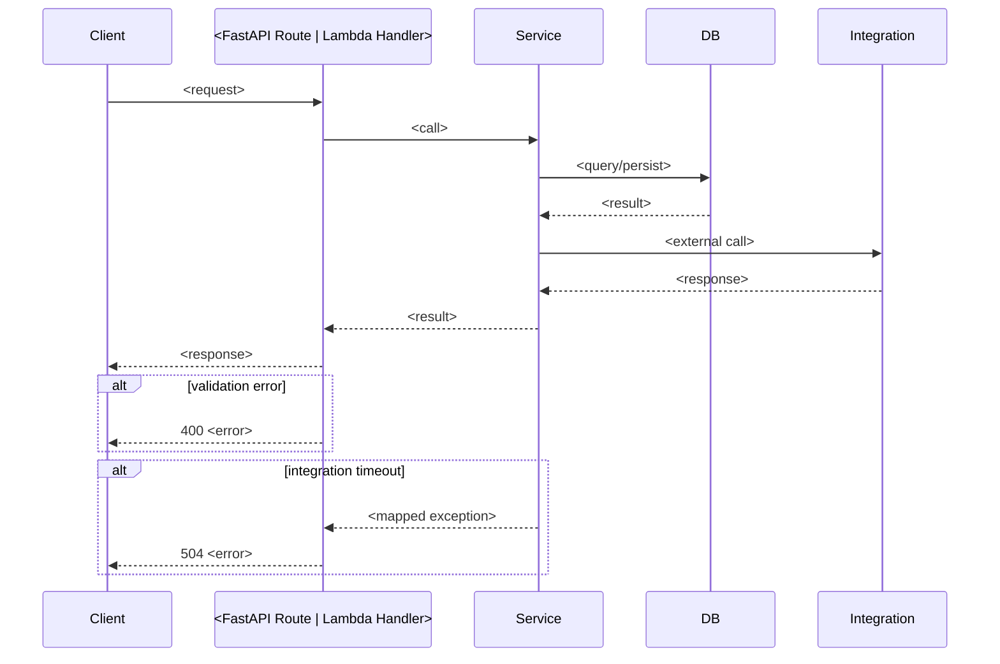
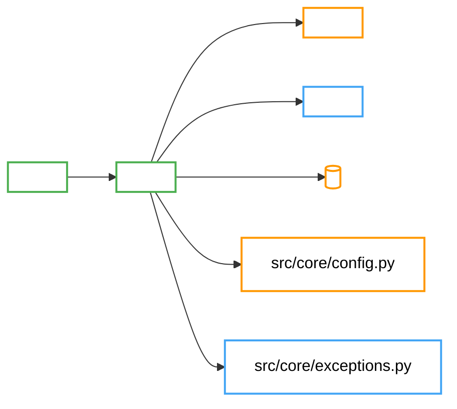

# Quick Start - AI-First Backend Workflow

This guide contains details of `.md` files and their content for GitHub Copilot (Agent Mode) to build a production-ready Python backend for Level 1 (foundation) and Level 2 (feature implementation) development. The workflow supports **two deployment targets**:

- **FastAPI** — long-running ASGI service (Docker + uvicorn) deployed to EKS/Fargate, ECS, or any container runtime.
- **AWS Lambda** — serverless deployment using **pure** AWS Lambda handler functions (`def lambda_handler(event, context):`). The Lambda path is **independent of FastAPI** — no Mangum, no ASGI adapter, no FastAPI imports inside handlers.

The deployment method is selected dynamically by reading the **Deployment Target** field in `PROJECT_OVERVIEW.md` (see "Deployment Target Decision Flow" below).

## Cortex-model-configuration-Step: Cortex Model Configuration Setup (Conditional)
This step runs **once per project**, **before Pre-Step**, and **only when** `LLM Provider: Cortex` is set in `PROJECT_OVERVIEW.md`. The goal is to register a new Cortex model configuration via the Cortex API and record the returned model name back into `PROJECT_OVERVIEW.md` so all subsequent steps can reference it. If `Cortex Model Name` is already populated with a valid name, skip this step entirely.

## Pre-Step: Populate Feature Implementation Template
The goal of the Pre-Step is to transform the generic `FEATURE_IMPLEMENTATION.md` template into a project-specific document by populating it with data from the project's BRD, user stories, and overview — without inventing any details.

## Level 1: Foundation/Project Kickoff
The goal of Level 1 is to create the project skeleton, including the folder structure and basic files, without implementing any specific features or business logic.

## Level 2: Sprint 1-N - Feature Implementation
The goal of Level 2 is to implement specific features based on the user stories and technical specifications provided in the project files. Level 2 runs in three sub-phases in sequence:
1. **Design Decision Extraction Pre-Step** — Extract design decisions from `FEATURE_IMPLEMENTATION.md` and get developer sign-off. Runs once before code generation starts.
2. **Code Generation** — Generate backend code driven by the confirmed design decisions.
3. **Post-Generation Explainability Step** — Auto-generate explainability artifacts and inject `# why:` comments. Runs automatically after code generation, once per user story.

## Design Decision Extraction Pre-Step (Level-2 sub-phase 1 — Mandatory)
Before Level-2 code generation begins, the AI reads `FEATURE_IMPLEMENTATION.md` and extracts a checklist of design decisions that will govern fresh code generation. This checklist is then presented to the developer for sign-off, ensuring both sides are aligned on design intent before any code is written. **This step is scoped to Level 2 only — it does not apply to Level 1.**

## Level-2 Post-Generation Explainability Step
The goal of the Post-Step is to make a freshly generated user story understandable in seconds. After Level-2 codegen completes for one user story, this step produces four Markdown artifacts under `docs/explainability/<US-ID>/` (change summary, service-flow Mermaid sequence diagram, architecture Mermaid component diagram, AC-to-code traceability matrix) and injects one-line `# why:` comments into the generated `.py` files for non-trivial logic blocks. Runs once per user story, before the Level-2 evaluation prompt.

---

## File Map - What Each `.md` Covers

**Input Files:**
- `BRD.md`: Project business related document.
- `UserStories.md`: Project user stories.
- `project_overview.md`: Project description, stakeholders, business requirements, objectives, scope, timeline, risks.

**Foundation Documents:**
- `QUICKSTART.md`: Step-by-step guide to set up and use the `.md` files. (current file)
- `PYTHON_CODING_STANDARDS.md`: Static Lilly standards - Pre-defined organizational coding conventions for naming, structure, documentation, etc.
- `.github/copilot-instructions.md`: Copilot configuration - references project documents, team preferences, prompt patterns.
- `PROJECT-REPOSITORY-SETUP.md`: Scaffolding spec - folders, starter files, configuration, sample endpoints, DB init.

**Sprint Implementation Documents:**

- `FEATURE_IMPLEMENTATION.md`: Business requirements, user stories breakdown into task and subtask along with execution plan (business logic, workflows, integration specs, API routes, service layer, request/response models)

**Post-Generation Documents:**
- `QUICKSTART.md` → "Level-2 Post-Generation Explainability Step": Defines the 5 explainability artifacts (change summary, service flow diagram, architecture diagram, traceability matrix, why-comment enrichment) generated under `docs/explainability/<US-ID>/` after each Level-2 user story.

**Optional/Reference Documents:**
- `COMPLETE_EXAMPLE.md` (optional): End-to-end reference - one implemented feature from route → service → DB → integration.
- `cortex_implementation.md` (conditional): Cortex LLM integration guide. Consulted **only when** `LLM Provider: Cortex` is set in `PROJECT_OVERVIEW.md`. Contains `light_client/` setup, `cortex_client.py` template, auth patterns, RAGAS evaluation integration, and deployment-target-specific wiring instructions.

---

## LLM Provider Decision Flow

If the project uses an LLM, **MUST** read the `LLM Provider` field in `PROJECT_OVERVIEW.md` before generating any LLM-related code:

| Value | Action |
|-------|--------|
| `Cortex` | Read and follow `cortex_implementation.md` for all LLM integration steps. The `light_client/` folder must be present at the project root. |
| Other | Follow the LLM integration specified in `FEATURE_IMPLEMENTATION.md` using the provider's SDK directly. |
| `None` | No LLM integration needed; skip LLM-related steps. |
| _missing_ | **STOP** and ask the user which LLM provider to use. |

> **Cortex vs other providers:** Cortex is an internal LLM API gateway requiring `LIGHTClient` authentication. It is _not_ a public SDK. All Cortex-specific instructions live in `cortex_implementation.md` — do not mix them into non-Cortex implementations.

---

## RAGAS Evaluation Decision Flow

**When `LLM Provider: Cortex`**, scan project documents for AI output evaluation requirements before generating any RAGAS-related code:

1. **Read** `BRD.md`, `UserStories.md`, and `PROJECT_OVERVIEW.md` for evaluation signals.
2. **Decide** whether to generate RAGAS integration:

   | Signal in project documents | Action |
   |-----------------------------|--------|
   | BRD or User Stories explicitly require evaluating AI output quality, answer correctness, model benchmarking, RAG quality assessment, or model comparison | Generate RAGAS integration — follow the **RAGAS Evaluation Integration** section in `cortex_implementation.md` |
   | No evaluation requirement found in any project document | Skip RAGAS entirely; do not generate any RAGAS files |
   | Evaluation is hinted but not explicit | **STOP** and ask the user before generating |

3. **Apply the same decision in Level 2.** When implementing a feature:
   - If RAGAS is required → generate `src/services/ragas_evaluation_service.py` plus the target-appropriate endpoint/handler and Pydantic models.
   - Follow the **Cortex RAGAS Evaluation File Matrix** in `PROJECT-REPOSITORY-SETUP.md` for the complete list of files.

> **RAGAS is conditional within Cortex:** Even when `LLM Provider: Cortex` is set, RAGAS files are only generated when the project explicitly requires AI output evaluation. Never generate RAGAS files speculatively.

---

Both Level 1 (skeleton) and Level 2 (feature implementation) **MUST** honor the deployment target declared by the user. Use the following flow before generating any code:

1. **Read** the `Deployment Target` field in `PROJECT_OVERVIEW.md` (Section 2 — Tech Stack Decisions). Allowed values: `FastAPI`, `AWS Lambda`, `FastMCP Server`, `FastAPI + FastMCP`, `AWS Lambda + FastMCP`.
2. **Decide** which artifacts to generate:

   | Value                  | Generate                                                                                                                                                                                                                      | Do NOT generate                                                                                         |
   |------------------------|-------------------------------------------------------------------------------------------------------------------------------------------------------------------------------------------------------------------------------|---------------------------------------------------------------------------------------------------------|
   | `FastAPI`              | `src/main.py`, `src/server.py`, `src/api/routes/*`, `src/middleware/`, `deployment/fastapi/` (Dockerfile, docker-compose)                                                                                                    | `src/lambda_handlers/`, `deployment/lambda/`, `src/mcp_server/`                                        |
   | `AWS Lambda`           | `src/lambda_handlers/*` (pure handlers), `src/utils/lambda_response.py`, `deployment/lambda/template.yaml`, `deployment/lambda/serverless.yml`, `deployment/lambda/build.sh`                                                 | `src/main.py`, `src/server.py`, `src/api/routes/`, `src/middleware/`, FastAPI/uvicorn deps, `src/mcp_server/` |
   | `FastMCP Server`       | `src/mcp_server/server.py` (FastMCP entry point), `src/mcp_server/tools/`, `src/mcp_server/resources/`, `src/mcp_server/prompts/`, `deployment/mcp/`                                                                         | `src/main.py`, `src/server.py`, `src/api/routes/`, `src/middleware/`, `src/lambda_handlers/`, `deployment/fastapi/`, `deployment/lambda/` |
   | `FastAPI + FastMCP`    | All `FastAPI` artifacts above **plus** all `FastMCP Server` artifacts above                                                                                                                                                   | `src/lambda_handlers/`, `deployment/lambda/`                                                            |
   | `AWS Lambda + FastMCP` | All `AWS Lambda` artifacts above **plus** all `FastMCP Server` artifacts above (MCP server runs as a separate long-lived process — NOT inside Lambda)                                                                         | `src/main.py`, `src/server.py`, `src/api/routes/`, `src/middleware/`, FastAPI/uvicorn deps              |
   | _missing_              | **STOP** and ask the user which target to use                                                                                                                                                                                 | —                                                                                                       |

3. **When the target includes FastMCP**, also read:
   - `MCP Transport` field (`stdio`, `streamable-http`, or `sse`) — if missing, STOP and ask.
   - `MCP Server Name` field — if missing, STOP and ask.
   - `FastMCP Version` field — default to **FastMCP 2.x** (`from fastmcp import FastMCP`) unless the project explicitly pins 1.x. Never mix both versions in one project.

4. **Apply the same decision in Level 2.** When implementing a feature endpoint/capability:
   - **FastAPI** → add a route in `src/api/routes/<feature>.py` and wire it in `src/main.py`.
   - **AWS Lambda** → add a handler in `src/lambda_handlers/<feature>_handler.py` AND register it in `deployment/lambda/template.yaml` and `deployment/lambda/serverless.yml` (one function per endpoint, with the correct API Gateway event).
   - **FastMCP (any combination)** → classify the capability as a **tool** (model-invoked action), **resource** (client-pulled read-only data, URI-addressed), or **prompt** (reusable user-invoked template); create the matching file under `src/mcp_server/tools/`, `src/mcp_server/resources/`, or `src/mcp_server/prompts/`; keep the decorator (`@mcp.tool`, `@mcp.resource`, `@mcp.prompt`) in the MCP module and delegate all business logic to `src/services/`.

5. **AWS Lambda handler rules (MANDATORY):**
   - Entry point MUST be `def lambda_handler(event, context):`.
   - MUST NOT import `fastapi`, `starlette`, or `mangum`.
   - MUST validate input from `event` using Pydantic models from `src/models/`.
   - MUST delegate business logic to `src/services/` (framework-agnostic).
   - MUST return responses via `src/utils/lambda_response.py` (correct `statusCode`, `headers`, JSON-serialized `body`).
   - MUST map domain exceptions from `src/core/exceptions.py` to appropriate HTTP status codes.

6. **FastMCP rules (MANDATORY when target includes FastMCP):**
   - `src/mcp_server/server.py` is the sole entry point; it instantiates `FastMCP(name=...)`, configures lifespan, and starts the transport.
   - Do NOT place `@mcp.tool` / `@mcp.resource` / `@mcp.prompt` decorators in the same module as FastAPI `@router` decorators.
   - Do NOT call one `@mcp.tool` from inside another tool; extract shared logic to `src/services/`.
   - Do NOT hardcode the MCP transport; read it from env/config (e.g., `MCP_TRANSPORT`).
   - Integration tests for MCP tools MUST use the in-memory `fastmcp.Client` pattern under `tests/mcp/`.

7. **Keep services framework-agnostic.** Code under `src/services/`, `src/database/`, `src/integrations/`, `src/models/`, `src/core/`, `src/utils/` (excluding `lambda_response.py`), and `src/logger/` MUST work unchanged for any deployment target — FastAPI routes, Lambda handlers, and FastMCP tools all delegate to the same service layer.

---

## Stepwise Workflow

### Cortex-model-configuration-Step: Cortex Model Configuration Setup (Conditional)

**Run only if** `LLM Provider: Cortex` in `PROJECT_OVERVIEW.md`.

1. Read the `Cortex Model Name` field in `PROJECT_OVERVIEW.md`.
2. If a valid model name is present → **skip this step** and continue to Pre-Step.
3. If the field is `NEW`, blank, or missing → follow **Cortex-model-configuration-Step: Cortex Model Configuration Setup** in `cortex_implementation.md` to create a new Cortex model config (POST `/model`) and record the returned `name` back into `PROJECT_OVERVIEW.md`.

This runs **once per project**. All later steps assume `Cortex Model Name` is populated.

**Prompt:** Refer QUICKSTART.md and cortex_implementation.md and follow Cortex-model-configuration-Step: Cortex Model Configuration Setup.

---

### Pre-Step: Populate Feature Implementation Template

Before starting Level 1 or Level 2, the generic `FEATURE_IMPLEMENTATION.md` template must be populated with project-specific data.


**Rules:**
1. Use only facts present in the source files (`BRD.md`, `UserStories.md`, `PROJECT_OVERVIEW.md`); do not invent details.
2. Preserve the existing headings and overall structure of the template.
3. Replace placeholders like `{PLACEHOLDER}` with project-specific content.
4. Ensure the returned content is complete, replacing **all** placeholders to create a comprehensive project-specific document. This content will replace the original file content in subsequent steps.
5. If additional information is present in the sources that is highly relevant but not part of the template, include it in the most appropriate section.
6. If a detail is missing, keep `TBD` rather than guessing.
7. Ensure the final document is clear, concise, and professional.
8. Return only the updated markdown — no code fences.

**Result:** A fully populated, project-specific `FEATURE_IMPLEMENTATION.md` ready to drive Level 2 feature implementation.

**Prompt:** Refer QUICKSTART.md and follow Pre-Step: Populate Feature Implementation Template. Use the rules defined in this section while populating the template.

---

### Design Decision Extraction Pre-Step (Level-2 sub-phase 1 — Mandatory before Level-2 code generation)

**Purpose:** Before Level-2 code generation begins, extract the design decisions embedded in the populated `FEATURE_IMPLEMENTATION.md` and surface them as an explicit checklist. This ensures code generation is driven by the design spec — not by existing code patterns that may conflict.

**Scope:** This step applies to Level 2 only. It does not run during Level 1 (skeleton generation).

**When to run:** After the Pre-Step has populated `FEATURE_IMPLEMENTATION.md` and before Level-2 code generation starts. This step runs once per Level-2 session (or once per user story batch if multiple stories are being implemented).

**Step 1: Extract Design Decisions (AI performs automatically)**

Read the populated `FEATURE_IMPLEMENTATION.md` and extract a checklist covering:

1. **Data Access Patterns** — How does the spec say data should be read/written?
   - Repository pattern vs direct DB access in services
   - ORM vs raw SQL vs query builder
   - Connection pooling / session management approach
   - Caching layer (if specified)

2. **API Behavior Contracts** — What does the spec prescribe for endpoint behavior?
   - Request/response schema (field names, types, casing)
   - Pagination strategy (cursor-based, offset/limit, keyset)
   - Error response structure and HTTP status code mapping
   - Versioning approach (path-based, header-based)

3. **Integration Contracts** — How should external services be called?
   - Authentication method (API key, OAuth, mTLS)
   - Retry/backoff strategy
   - Timeout values
   - Circuit-breaker or fallback behavior
   - Data mapping (field transformation between internal and external models)

4. **Service Layer Design** — What patterns does the spec expect?
   - Dependency injection vs direct instantiation
   - Sync vs async execution model
   - Transaction boundaries
   - Event/notification patterns (if any)

5. **Business Logic Rules** — What logic rules are explicitly stated?
   - Validation rules beyond simple type checks
   - State machine transitions (if any)
   - Conditional workflows (if-then business rules)
   - Computed/derived fields

**Output format for the checklist:**

```markdown
## Design Decision Checklist — [User Story IDs]

### Data Access
- [ ] {Decision 1 — e.g., "Use repository pattern; services must NOT query DB directly"}
- [ ] {Decision 2 — e.g., "Async SQLAlchemy sessions via dependency injection"}

### API Contracts
- [ ] {Decision 1 — e.g., "Response fields in snake_case; 422 for validation errors with `detail` array"}
- [ ] {Decision 2 — e.g., "Cursor-based pagination using `next_cursor` field"}

### Integration Contracts
- [ ] {Decision 1 — e.g., "Cortex calls use exponential backoff: 3 retries, base 1s, max 8s"}
- [ ] {Decision 2 — e.g., "External API timeout = 30s; map 5xx to 503 with retry-after header"}

### Service Layer
- [ ] {Decision 1 — e.g., "All services receive dependencies via constructor injection"}
- [ ] {Decision 2 — e.g., "Async-first; no synchronous blocking calls in service methods"}

### Business Logic
- [ ] {Decision 1 — e.g., "Evaluation score < 0.5 triggers re-evaluation flag; does not auto-reject"}
- [ ] {Decision 2 — e.g., "Document status transitions: draft → submitted → approved | rejected"}
```

**Rules:**
- Extract only decisions that are **explicitly stated or directly implied** by the populated `FEATURE_IMPLEMENTATION.md`. Do not invent decisions.
- If a category has no relevant decisions in the spec, write "No explicit decisions in spec — will follow existing project patterns" for that category.
- Each checklist item must be specific enough that a reviewer can verify it in the generated code.

---

**Step 2: Write Checklist to FEATURE_IMPLEMENTATION.md and Await Sign-Off (MANDATORY — do not skip)**

After extracting the checklist, **append it as a new section at the very end of `FEATURE_IMPLEMENTATION.md`** using this exact format:

```markdown
---

## Design Decision Checklist — [User Story IDs]

> Auto-generated before Level-2 code generation. Review each item, modify if needed, then confirm in chat to proceed.

### Data Access
- [ ] {Decision 1}
- [ ] {Decision 2}

### API Contracts
- [ ] {Decision 1}
- [ ] {Decision 2}

### Integration Contracts
- [ ] {Decision 1}
- [ ] {Decision 2}

### Service Layer
- [ ] {Decision 1}
- [ ] {Decision 2}

### Business Logic
- [ ] {Decision 1}
- [ ] {Decision 2}
```

After writing the section to `FEATURE_IMPLEMENTATION.md`, send **only this short message** in chat — do not reproduce the checklist in chat:

```
I've populated the Design Decision Checklist at the end of `FEATURE_IMPLEMENTATION.md`.
Please review and modify it there as needed, then reply here to confirm and I will proceed with Level-2 code generation.
```

**Rules:**
- **MUST NOT** begin Level-2 code generation until the developer confirms in chat.
- The developer may edit the checklist directly in `FEATURE_IMPLEMENTATION.md` before confirming — accept their file edits as the final checklist.
- If the developer says "proceed", "looks good", "go ahead" (or equivalent), re-read the checklist section from `FEATURE_IMPLEMENTATION.md` to pick up any edits, then treat it as sign-off and continue to Level 2.
- Store the confirmed checklist as the **design intent reference** — during code generation, if an existing code pattern conflicts with a confirmed checklist item, the "Existing Code Override Justification Rule" in `copilot-instructions.md` applies.

**Prompt:** Refer QUICKSTART.md and follow Design Decision Extraction Pre-Step before starting Level 2 implementation.

---

### Level 1: Foundation/Project Kickoff

1. **Refer `project_overview.md` and `BRD.md`**  
   - Understand project description, stakeholders, and target users.
   - Review business requirements summary and objectives.
   - Understand project scope (in/out of scope) and success criteria.
   - Note dependencies, constraints, and risks.

2. **Refer `UserStories.md`**  
   - Understand business requirements.
   - Go through user stories in detail.

3. **Review `PYTHON_CODING_STANDARDS.md`**  
   - Familiarize yourself with Lilly's organizational Python coding standards and best practices. Strictly adhere to these standards while generating code.

4. **Refer configured `.github/copilot-instructions.md`**  
   - This will provide more information on how to assist this project.

5. **Determine the deployment target**
   - Read the `Deployment Target` field from `PROJECT_OVERVIEW.md` (Section 2 — Tech Stack Decisions).
   - Apply the **Deployment Target Decision Flow** above. If the field is missing or unclear, STOP and ask the user.
   - If the target includes FastMCP, also read `MCP Transport` and `MCP Server Name`; if either is missing, STOP and ask.

6. **Determine the LLM provider (if applicable)**
   - Read the `LLM Provider` field from `PROJECT_OVERVIEW.md`.
   - Apply the **LLM Provider Decision Flow** above.
   - If `LLM Provider: Cortex`, confirm the `light_client/` folder is present at the project root before proceeding.

7. **Determine RAGAS evaluation requirement (when `LLM Provider: Cortex`)**
   - Scan `BRD.md`, `UserStories.md`, and `PROJECT_OVERVIEW.md` for AI output evaluation signals.
   - Apply the **RAGAS Evaluation Decision Flow** above.
   - If RAGAS is required, apply the **Cortex RAGAS Evaluation File Matrix** in `PROJECT-REPOSITORY-SETUP.md` when executing the skeleton step.

8. **Execute `PROJECT-REPOSITORY-SETUP.md`**  
   - Generate the project folder structure following the **Target‑Specific File Generation Matrix** in `PROJECT-REPOSITORY-SETUP.md`.
   - Always create the runtime-agnostic core (`src/services/`, `src/models/`, `src/database/`, `src/core/`, `src/integrations/`, `src/logger/`, `src/utils/`, `scripts/`, `.env.example`, `.gitignore`, `requirements.txt`, `README.md`).
   - **If target = `FastAPI`:** create `src/main.py` (FastAPI app), `src/server.py` (uvicorn runner), `src/api/routes/health.py`, `src/middleware/`, and `deployment/fastapi/` (Dockerfile, docker-compose.yml).
   - **If target = `AWS Lambda`:** create `src/lambda_handlers/health_handler.py` (pure `def lambda_handler(event, context):` — NO FastAPI), `src/utils/lambda_response.py`, and `deployment/lambda/` (`template.yaml` for AWS SAM, `serverless.yml` for Serverless Framework, `build.sh` for packaging).
   - **If target includes `FastMCP`:** create `src/mcp_server/server.py` (FastMCP entry point — instantiates `FastMCP(name=...)`, configures lifespan, starts transport), `src/mcp_server/tools/`, `src/mcp_server/resources/`, `src/mcp_server/prompts/`, `tests/mcp/`, and `deployment/mcp/`. Combination targets (`FastAPI + FastMCP`, `AWS Lambda + FastMCP`) also include their respective REST artifacts above.
   - Tailor `requirements.txt` to the target: include `fastapi`/`uvicorn` only when FastAPI is in scope; for Lambda‑only, exclude FastAPI/uvicorn entirely; include `fastmcp` only when a FastMCP target is in scope.
   - For each folder in the structure, create an `__init__.py` file and an additional `.py` file that serves a specific purpose. Below is the purpose for each `.py` file:
     - **`api/`** _(FastAPI only)_: Create `routes.py` to define API endpoints.
     - **`lambda_handlers/`** _(Lambda only)_: Create one `<feature>_handler.py` per endpoint with a pure `lambda_handler(event, context)` function.
     - **`mcp_server/tools/`** _(FastMCP only)_: Create `health.py` with a `@mcp.tool`-decorated health-check tool.
     - **`mcp_server/resources/`** _(FastMCP only)_: Create a placeholder resource file; delete if unused.
     - **`mcp_server/prompts/`** _(FastMCP only)_: Create a placeholder prompt file; delete if unused.
     - **`core/`**: Create `config.py` to manage application configurations.
     - **`database/`**: Create `models.py` to define database models.
     - **`integrations/`**: Create `external_services.py` to handle external service integrations.
     - **`logger/`**: Create `logging_config.py` to configure logging for the application.
     - **`middleware/`** _(FastAPI only)_: Create `custom_middleware.py` to define custom middleware.
     - **`models/`**: Create `schemas.py` to define Pydantic models for request/response validation.
     - **`services/`**: Create `business_logic.py` to implement business logic (framework-agnostic; reusable from FastAPI routes, Lambda handlers, and FastMCP tools).
     - **`utils/`**: Create `helpers.py` to define utility/helper functions. When target includes Lambda, also create `lambda_response.py` for API Gateway response building.

**Result:** A working backend skeleton ready for further enhancement/development:
- For **FastAPI** target: runs with `uvicorn src.main:app --reload`.
- For **AWS Lambda** target: invokable locally with `sam local invoke <FunctionName>` or `serverless invoke local -f <function>`.
- For **FastMCP Server** target: runs with `fastmcp run src/mcp_server/server.py` (or `python -m src.mcp_server.server`).
- For **FastAPI + FastMCP** or **AWS Lambda + FastMCP** targets: both entry points above apply for their respective components.

**Prompt:** Refer QUICKSTART.md and follow Level 1: Foundation/Project Kickoff

**Evaluation Prompt:** Refer EVALUATION_METRICS.md and evaluate the Level 1: Foundation output. Run the Section 2 (Level 1: Foundation Evaluation) structural completeness checklist, then complete Section 4 (Qualitative Scoring Rubric) and Section 5 (Scoring Summary Template) for Level 1. Provide the final verdict with scores and store it in evaluation_result_level_1.md file.

---

### Level-2: Sprint 1-N- Feature Implementation

1. **Refer `project_overview.md` and `BRD.md`**  
   - Understand project description, stakeholders, and target users.
   - Review business requirements summary and objectives.
   - Understand project scope (in/out of scope) and success criteria.
   - Note dependencies, constraints, and risks.

2. **Refer `UserStories.md`**  
   - Understand business requirements.
   - Go through user stories in detail.

3. **Go through `FEATURE_IMPLEMENTATION.md`**
   - Review the provided user stories you need to implement.
   - Understand business requirements and acceptance criteria.
   - Understand the execution plan in detail.
   - Gather the relevant task and subtask required to be executed.
   - **IMPORTANT: Identify and separate backend tasks from frontend tasks.**
   - Gather information related to backend requirements, including API routes, service layer, business logic, data models, and integrations.

4. **Execute Design Decision Extraction Pre-Step (MANDATORY before code generation)**
   - Follow the **Design Decision Extraction Pre-Step** defined earlier in this document.
   - Extract the design decision checklist from the populated `FEATURE_IMPLEMENTATION.md`.
   - Present the checklist to the developer and obtain sign-off.
   - **Do NOT proceed to code generation (step 7) until the developer confirms the checklist.**
   - The confirmed checklist becomes the binding design intent reference for the remainder of this Level-2 session.

5. **Review `PYTHON_CODING_STANDARDS.md`**  
   - Familiarize yourself with Lilly's organizational Python coding standards and best practices. Strictly adhere to these standards while generating code.

6. **(Optional) Refer `COMPLETE_EXAMPLE.md`**  
   - Refer to an end-to-end example for implementation that demonstrates how everything connects.
   - If this file is missing, create it after the first feature is built to serve as a template for remaining features.

7. **Execute Code Generation (Backend Only)**  
   - **IMPORTANT: Only implement backend components. Do not generate frontend code.**
   - **Apply the Deployment Target Decision Flow** before generating code for any endpoint.
   - **Apply the LLM Provider Decision Flow** before generating any LLM integration code:
     - If `LLM Provider: Cortex` → follow `cortex_implementation.md` steps (create `src/integrations/cortex_client.py`, update config/services/endpoint files, copy `light_client/`).
     - If another provider → use that provider's SDK as specified in `FEATURE_IMPLEMENTATION.md`.
   - **Apply the RAGAS Evaluation Decision Flow** (when `LLM Provider: Cortex`):
     - Scan `BRD.md`, `UserStories.md`, and `PROJECT_OVERVIEW.md` for AI evaluation requirements.
     - If required → follow the **RAGAS Evaluation Integration** section in `cortex_implementation.md` to generate `ragas_evaluation_service.py`, RAGAS endpoints/handlers, and Pydantic models.
     - If not required → skip all RAGAS files.
   - Use the technical specifications from `FEATURE_IMPLEMENTATION.md` to implement:
     - Request/Response models (Pydantic) — shared across both targets
     - Service layer with business logic (framework-agnostic Python) — shared across both targets
     - Database models and migrations (SQLAlchemy, Alembic etc.)
     - Integration clients (AWS SDK, Azure SDK, external APIs)
     - **If target includes FastAPI:** API routes wired into `src/main.py`, plus middleware
     - **If target includes AWS Lambda:** one **pure** `lambda_handler` per endpoint in `src/lambda_handlers/<feature>_handler.py` (NO FastAPI/Mangum imports), plus matching entries in `deployment/lambda/template.yaml` (AWS SAM) and `deployment/lambda/serverless.yml` (Serverless Framework)
     - **If target includes FastMCP:** classify each capability as a tool, resource, or prompt; create the appropriate file under `src/mcp_server/tools/`, `src/mcp_server/resources/`, or `src/mcp_server/prompts/`; decorate with `@mcp.tool`, `@mcp.resource`, or `@mcp.prompt`; delegate all business logic to `src/services/`; add integration tests under `tests/mcp/` using the in-memory `fastmcp.Client` pattern
     - Unit and integration tests (pytest) — when explicitly requested
   - **For frontend tasks:**
     - Identify the task as frontend-related
     - Document the required backend API support (endpoints, schemas)
     - Inform the user that frontend implementation is not in scope
   - Follow the implementation workflow defined in the user story.
   - Adhere to coding standards and use shared components where applicable.

8. **Auto-generate Explainability Artifacts (MANDATORY final phase — no separate prompt)**
   - Immediately after the source files for the user story are written and before returning the implementation summary, **automatically execute** the **Level-2 Post-Generation Explainability Step** (defined later in this file).
   - This is part of the same Level-2 turn — the developer does **not** issue a second prompt.
   - Output: `docs/explainability/<US-ID>/{change_summary.md, service_flow.md, architecture.md, traceability.md}` plus `# why:` comments injected into the modified `.py` files.
   - For multiple user stories implemented in one session, run the Post-Step after **each** story (not once at the end), so artifacts and why-comments stay scoped per `<US-ID>`.

**Result:** Backend features implemented with production-ready code; explainability artifacts auto-generated under `docs/explainability/<US-ID>/`; frontend tasks identified and documented for frontend team
   - Refer an end-to-end example for implementation that demonstrates how everything connects.
   - If this file is missing then you have to create this file after first feature is built to serve as template for remaining features for future reference.

**Prompt if one user story:** Refer QUICKSTART.md and follow Level 2: Sprint 1-N- Feature Implementation

**Prompt if multiple user stories:** Refer QUICKSTART.md and follow Level 2: Sprint 1-N- Feature Implementation. Implement all user stories sequentially, completing one user story fully before moving to the next. For each user story, list the backend tasks, implement them, and confirm completion before proceeding.

**Prompt for specific user stories:** Refer QUICKSTART.md and follow Level 2: Sprint 1-N- Feature Implementation. Implement only user stories [US-001, US-002, US-003] in the specified order.

**Evaluation Prompt:** Refer EVALUATION_METRICS.md and evaluate the Level 2: Feature Implementation output. Run Section 3 (Level 2: Feature Implementation Evaluation) for API contract fidelity and business logic correctness, then complete Section 4 (Qualitative Scoring Rubric) and Section 5 (Scoring Summary Template) for Level 2. Provide the final verdict with scores and store it in evaluation_result_level_2.md file.

---
## Additional Instructions for Copilot

### For Cortex-model-configuration-Step: Cortex Model Configuration Setup

This step is **conditional** — run it only when `LLM Provider: Cortex` is set in `PROJECT_OVERVIEW.md` AND `Cortex Model Name` is `NEW`, blank, or missing.

   1. **Check before running:**
   - Read `Cortex Model Name` in `PROJECT_OVERVIEW.md`.
   - If a valid model name already exists (e.g., `agentic-test112114`), skip this step entirely and proceed to Pre-Step.
   - If the value is `NEW`, blank, or missing, proceed with the steps below.

   2. **Gather required inputs from the developer before generating anything:**
   - `name` — unique model identifier (lowercase alphanumeric + dashes)
   - `displayName` — human-readable name
   - `model_description` — short purpose statement
   - `auth.owners` — at least one owner (user ID / email)
   - `chain[0].chain_class` — `doc-chain`, `model-only-chain`, or `agent-chain`
   - `model_versions[0].model_class` + `model_iteration` — underlying LLM class and iteration
   - **If any of the above is missing, STOP and ask the developer. Do not invent values.**

   3. **Generate the registration script only — do not execute it:**
   - Create `scripts/create_cortex_model.py` following the template in `cortex_implementation.md` (Cortex-model-configuration-Step, Step 3).
   - Fill in the values gathered from the developer in Step 2 above.
   - After generating the file, **stop**. Instruct the developer to run it manually:
     ```
     python scripts/create_cortex_model.py
     ```

   4. **After the developer runs the script:**
   - The script prints the registered model name on success.
   - Instruct the developer to update `PROJECT_OVERVIEW.md`:
     ```
     Cortex Model Name (MANDATORY if LLM Provider = Cortex): <returned-name>
     ```
   - Do not proceed to Pre-Step until `Cortex Model Name` is populated.

   5. **This step runs once per project:**
   - Once `Cortex Model Name` is populated in `PROJECT_OVERVIEW.md`, all subsequent steps (Level 1, Level 2) read the name from config and never re-run this step.

**Note:** Do not modify any file inside `light_client/`. Do not invent or hardcode Cortex model names. All model name references in generated code must read from `PROJECT_OVERVIEW.md` or environment variables. Do not generate RAGAS files unless the project's documents explicitly require AI output evaluation.

### For Level 1: Foundation/Project Kickoff
   1. Create the skeleton in the current folder:
   - Do not create a new folder or workspace. Use the current folder as the root directory for the project.
   - All files and folders should be created relative to the current directory.

   2. Avoid redundant workspace creation:
   - Do not initialize a new repository or workspace unless explicitly instructed.
   - Assume the current folder is already the working repository.

   3. Follow the PROJECT-REPOSITORY-SETUP.md structure:
   - Use the folder structure and file layout defined in PROJECT-REPOSITORY-SETUP.md.
   - Ensure all `__init__.py` and additional `.py`files are created in the same folder hierarchy as specified.
   - Strictly avoid duplicate file names across folders.

   4. Respect existing files:
   - Do not overwrite or move existing files unless explicitly instructed.
   - Add new files and folders as needed to complete the skeleton.

   5. Use relative paths:
   - When creating files or folders, use relative paths based on the current folder.

**Note:** Do not create test folders, test files, or pytest configuration. Testing will be handled separately.

### Additional Instructions for Multiple User Stories

When implementing multiple user stories in a single session:

   1. **Sequential Implementation**
      - Process user stories one at a time in priority order (as listed in `FEATURE_IMPLEMENTATION.md`)
      - Complete all backend tasks for one user story before moving to the next
      - Confirm completion of each user story before proceeding

   2. **Progress Tracking**
      - At the start, list all user stories to be implemented
      - After each user story, provide a status update:
      - Completed user stories
      - Current user story in progress
      - Pending user stories

   3. **Dependency Management**
      - Identify dependencies between user stories before starting
      - Implement foundational user stories first (e.g., authentication before protected endpoints)
      - Reuse components created in earlier user stories

   4. **Consolidated Code Changes**
      - When multiple user stories affect the same file, consolidate changes
      - Avoid creating duplicate code or conflicting implementations
      - Ensure all endpoints remain consistent with shared patterns

**Note:** Do not create test folders, test files, or pytest configuration. Testing will be handled separately.


### For Level 2: Sprint 1-N- Feature Implementation

   1. Understand the created skeleton for the project:
   - This created skeleton is your working repository or workspace
   - Do not create a new folder or workspace. Use the current folder as the root directory for the project.
   - All files and folders should be created relative to the current directory.

   2. **Identify Backend vs Frontend Tasks (MANDATORY)**
   - Before implementing any task from `FEATURE_IMPLEMENTATION.md`, determine if it is backend or frontend
   - **Backend tasks include:**
     - API endpoints (FastAPI routes) — when deployment target includes `FastAPI`
     - AWS Lambda handler functions (pure `lambda_handler(event, context)` — NO FastAPI/Mangum) — when deployment target includes `AWS Lambda`
     - Serverless deployment artifacts (`deployment/lambda/template.yaml`, `deployment/lambda/serverless.yml`, `build.sh`) — when deployment target includes `AWS Lambda`
     - Container deployment artifacts (`deployment/fastapi/Dockerfile`, `docker-compose.yml`) — when deployment target includes `FastAPI`
     - Request/Response models (Pydantic)
     - Service layer (business logic in Python — framework-agnostic, shared across both targets)
     - Database models (SQLAlchemy/ORM)
     - Database migrations (Alembic)
     - Integration clients (AWS Bedrock, S3, Azure AD, external APIs)
     - Middleware, utilities, helpers (note: `src/middleware/` is FastAPI-only; for Lambda use handler-level wrappers)
     - Data pipelines and background jobs
     - Backend unit and integration tests (pytest)
   - **Frontend tasks include:**
     - React/Angular/Vue components
     - UI elements (buttons, forms, tables, modals, dashboards)
     - CSS/styling
     - Client-side JavaScript
     - Browser-specific code
     - Frontend routing and navigation
     - UI component tests
   - **For frontend tasks:**
     - Do NOT generate any code
     - Respond with: "This is a frontend task. I am configured to generate backend code only."
     - Document any required backend API support (endpoints, schemas) that the frontend will consume
     - Provide the frontend team with the API contract and response schema

   3. **Validate API Contract Before Code Generation (MANDATORY)**
   - **Only generate code if complete API contract information is provided**
   - Required information:
     - Endpoint details: HTTP method, route path, parameters
     - Request schema: field names, data types, validation rules
     - Response schema: success/error structures with status codes
     - Business logic (Optional): validation rules, error handling, workflows
     - Database schema (Optional): table/column names, types, constraints (if applicable)
   - **If any information is missing or unclear:**
     - DO NOT generate code or make assumptions
     - Request specific missing details from the user
     - Example: "Missing information: [list what's needed]. Please provide the request/response schema for [endpoint]."

   4. **Execute Design Decision Extraction Pre-Step (MANDATORY before code generation)**
   - Follow the **Design Decision Extraction Pre-Step** instructions defined in the "Stepwise Workflow" section above.
   - Read the populated `FEATURE_IMPLEMENTATION.md` and extract a design decision checklist covering: data access patterns, API behavior contracts, integration contracts, service layer design, and business logic rules.
   - Present the checklist to the developer for sign-off.
   - **Do NOT proceed to step 5 (code generation) until the developer confirms.**
   - During code generation, if existing code in the workspace conflicts with a confirmed checklist item, apply the **Existing Code Override Justification Rule** from `copilot-instructions.md`: stop, name both approaches, and ask the developer.

   5. Understand the task from information provided in `FEATURE_IMPLEMENTATION.md`
   - Understand the task thoroughly and create step by step plan for **backend implementation only**
   - Review the generated task/subtask from provided user stories
   - **Filter out frontend subtasks** - do not implement these
   - Understand business requirements and acceptance criteria
   - Extract technical implementation details **for backend only**:
     - API endpoint specifications (request/response schemas with validation rules)
     - Database schema (tables, fields, types, constraints, relationships)
     - Business logic rules (validation, error handling, actions)
     - Integration requirements (external APIs to call, data mapping)
     - Implementation workflow (step-by-step process for backend)

   6. Generate production-ready **backend** code
   - You can modify code in available files to complete the implementation
   - Adhere to tech stack decisions and cloud service configurations
   - Implement security requirements (authentication, authorization, encryption)
   - Follow API design standards and conventions
   - Use environment variables defined in the specifications
   - If necessary, add new files and folders following the project structure
   - Follow the implementation workflow defined in the user story
   - Adhere to coding standards from `PYTHON_CODING_STANDARDS.md`
   - **STOP if you encounter a frontend task** - inform the user instead of generating code

   7. Implement only backend features mentioned
   - Do not add any features which are not specified by the user
   - **Do not implement frontend features** - only backend API support
   - Focus on completing the backend acceptance criteria defined in the user story
   - If any backend functionality is unclear, create placeholder functions with descriptive names to maintain the workflow's continuity
   
   8. **Consolidate endpoint logic into single route handlers (MANDATORY)**
   - For each API endpoint, consolidate all related logic into a single entry point — a single FastAPI route handler **or** a single Lambda handler function (depending on the deployment target).
   - Avoid splitting logic for the same endpoint across multiple handlers or functions.
   - Ensure each handler is self-contained with all necessary input validation, business-logic delegation (to `src/services/`), and error handling.
   - When implementing changes or enhancements:
     - Identify all relevant endpoints that need modification
     - Update each relevant endpoint with the required changes
     - Maintain consistency across all affected endpoints
     - Do not create duplicate or partial implementations
   - Example: If implementing authentication, apply it to all protected endpoints consistently
   
   9. Use relative paths:
   - When creating files or folders, use relative paths based on the current folder.

   10. (Optional) Refer to `COMPLETE_EXAMPLE.md`
   - Refer to an end-to-end example for backend implementation
   - If this file is missing, you can create it after the first backend feature is built to serve as a template.

   11. **Auto-run the Level-2 Post-Generation Explainability Step (MANDATORY — no user prompt required)**
   - As the **final phase** of every Level-2 user story implementation, before declaring the story complete, **automatically execute** the **Level-2 Post-Generation Explainability Step** defined below.
   - This is **not optional and not a separate developer prompt**. It runs as part of the same Level-2 turn, after all source files for the user story are saved and before the implementation summary is returned to the developer.
   - The step produces, in `docs/explainability/<US-ID>/`:
     - `change_summary.md` (Section A)
     - `service_flow.md` (Section B — Mermaid `sequenceDiagram`)
     - `architecture.md` (Section C — Mermaid `flowchart`)
     - `traceability.md` (Section D — AC → file:function table)
     - and injects one-line `# why:` comments (Section E) into the `.py` files modified for this user story.
   - The implementation summary returned to the developer at the end of Level-2 **MUST** explicitly list the four artifact paths created and confirm that the why-comment pass ran with verification.
   - **When implementing multiple user stories sequentially**: run the Post-Step after **each** user story, not once at the end. The artifacts and why-comments are scoped per `<US-ID>`.
   - The per-section prompts in `prompts.md` exist **only for regenerating a single artifact later** (e.g., after a manual code edit) — they are not the primary trigger.

---

### Level-2 Post-Generation Explainability Step

**Purpose:** Make a freshly generated user story understandable in seconds. After Level-2 codegen for one user story completes, this step produces four Markdown artifacts plus inline `# why:` comments injected into the generated `.py` files. Runs once per user story.

**Execution model — AUTOMATIC (no developer prompt required after sign-off):**
- This step runs **automatically as the final phase of every Level-2 user story implementation**, in the same turn as the codegen. It is mandated by step 8 of `### Level-2: Sprint 1-N- Feature Implementation` and step 11 of `### For Level 2: Sprint 1-N- Feature Implementation` in this document.
- **Pre-condition:** The Design Decision Extraction Pre-Step (step 4 / step 4 in the two lists above) must complete and the developer must have confirmed the checklist before code generation starts. Once the developer issues the Level-2 prompt and confirms the checklist, code generation and the Post-Step both proceed automatically.
- The developer does **not** need to issue any explainability-specific prompt after the design decision sign-off.
- It must complete **before** the implementation summary is returned to the developer. The summary MUST list the four artifact paths created and confirm the why-comment pass ran with verification.
- The Level-2 evaluation prompt is run by the developer **after** Level-2 returns; the explainability artifacts are already in place by then.

**Per-section regeneration prompts (manual, optional):**
- The prompts in `prompts.md` → "Level 2 Post-Step: Explainability Artifacts" exist **only for regenerating a single artifact** after a manual code edit (e.g., the developer hand-edits the service layer and wants a fresh `service_flow.md`).
- These prompts are **not** the primary trigger and **not** required in the normal workflow.

**Output location (MANDATORY):**
- All Markdown artifacts under `docs/explainability/<US-ID>/` at the project root. Create the folder if missing.
- The `<US-ID>` matches the user story identifier in `FEATURE_IMPLEMENTATION.md` (e.g., `US-001`).
- **Never write explainability artifacts under `src/`, `deployment/`, or `light_client/`.**

**Inputs Copilot MUST read before generating any artifact:**
1. `FEATURE_IMPLEMENTATION.md` — the user story, acceptance criteria (verbatim), API contract, workflow.
2. The freshly generated source files under `src/` for this user story — routes/handlers, services, models, integrations, exceptions, config. Diagrams MUST reflect actual code, not the spec.
3. `PROJECT_OVERVIEW.md` — `Deployment Target` field drives whether the entry-point participant in flow diagrams is `FastAPI Route` or `Lambda Handler`.
4. `requirements.txt` — to identify dependencies added for this user story (used by Section A).

**General rules across all five sections:**
- Diff-scoped, not project-wide: only describe files created or modified for THIS user story.
- No invention. If a fact (file, function, Acceptance Criteria) cannot be confirmed by reading the inputs above, mark it `TBD` or `—` rather than guessing.
- All Mermaid blocks must render in standard VSCode Mermaid preview (no extension-specific syntax).

---

#### Section A — Change Summary (`change_summary.md`)

Output file: `docs/explainability/<US-ID>/change_summary.md`

Required headings, in this order:

```markdown
# Change Summary — <US-ID>: <Story Title>

## 1. User Story
<US-ID>: <one-line story title from FEATURE_IMPLEMENTATION.md>

## 2. New Files Added
- `<path>` — <one-line purpose>
- ...

## 3. Modified Files
- `<path>` — <one-line description of what changed>
- ...

## 4. Key Functions Introduced
| Function | File | Purpose |
|----------|------|---------|
| `<name>` | `<path>` | <one-line purpose> |

## 5. Dependencies Added
- `<package>==<version>` — <reason this user story needed it>
- (none, if no entries added to requirements.txt)

## 6. Design Decisions Applied
- <Non-obvious choice 1 — e.g., "Service-layer retry instead of handler-layer because Lambda timeouts cap retries at function level."> 
- <Non-obvious choice 2 — e.g., "Used Pydantic `model_config = ConfigDict(extra='forbid')` to reject unknown request fields per AC-3.">
```

Rules specific to Section A:
- Diff-scoped — only files this user story created/modified, never the whole project.
- Each bullet exactly one line. No code snippets in this artifact.
- "Design Decisions Applied" lists only choices a reviewer cannot infer from the code itself.

---

#### Section B — Service Logic Flowchart (`service_flow.md`)

Output file: `docs/explainability/<US-ID>/service_flow.md`

Required structure: one `### Endpoint:` heading per endpoint in the user story, each followed by a one-line caption and a single fenced ` ```mermaid ` block containing a `sequenceDiagram`.

Template (one block per endpoint):

```markdown
### Endpoint: <METHOD> <PATH>

*Generated from: `<entry-file>` → `<service-file>`*


```

Rules specific to Section B:
- Entry participant label MUST match `Deployment Target` from `PROJECT_OVERVIEW.md`:
  - `FastAPI Route` — when target is `FastAPI`
  - `Lambda Handler` — when target is `AWS Lambda`
  - `MCP Tool / Resource / Prompt` — when target includes `FastMCP` (use the specific component type: `MCP Tool`, `MCP Resource`, or `MCP Prompt` based on the `src/mcp_server/{tools|resources|prompts}/` file involved; if an endpoint spans a mix, list the primary entry component)
- When the target includes **FastMCP**, also show the `MCP Server` participant between `Client` and the MCP component if the server routes the call (i.e., `Client->>MCP Server->>MCP Tool/Resource/Prompt`); omit it if the tool is invoked directly.
- Include `DB` participant only if the endpoint touches the database; include `Integration` only if it calls an external API/SDK. Drop unused participants.
- `alt` error branches MUST correspond to error paths actually present in the generated code (validation, integration timeout, DB error, mapped domain exceptions). Do not invent error paths.
- Multiple endpoints in the same user story → one `### Endpoint:` block each in the same file.
- **MANDATORY — Mermaid message label quoting:** Every sequenceDiagram message label (the text after `->>` or `-->>`) MUST be wrapped in double quotes if it contains ANY of the following characters: `+`, `{`, `}`, `[`, `]`, `(`, `)`, `|`, `;`, `*`, `/`, `—`, `,`. Failing to quote these characters causes a Mermaid parse error and prevents the diagram from rendering. When in doubt, quote all message labels. Example — invalid: `Client->>Entry: POST /api/dashboard {tab} + Bearer token` — valid: `Client->>Entry: "POST /api/dashboard — tab, page_size, Bearer token"`.

---

#### Section C — Architecture Integration Diagram (`architecture.md`)

Output file: `docs/explainability/<US-ID>/architecture.md`

Required content: a single fenced ` ```mermaid ` block containing a `flowchart` that shows where the new modules sit relative to existing services, integrations, DB models, and handlers.

Template:

```markdown
# Architecture Integration — <US-ID>



**Legend:** Green (`:::new`) = created for this user story. Orange (`:::modified`) = existing module changed for this user story. Blue = existing module touched but unchanged (read-only dependency).
```

Rules specific to Section C:
- Apply `:::new` to modules **created** (did not exist before this user story) for this user story.
- Apply `:::modified` to modules that **already existed but were changed** (new functions added, existing functions edited, config keys added, new exception classes added, etc.) for this user story.
- Leave all other existing modules without an explicit class — they will pick up `classDef default` (blue border, transparent fill) automatically, distinguishing them as read-only dependencies.
- Show only modules actually wired into the new code path. Do **not** draw the entire project tree.
- Edge labels (optional) should describe the call relationship: `calls`, `imports`, `persists to`, `reads from`.
- Read the project-root file tree **and** the diff of modified files to correctly distinguish new vs modified vs unchanged.

---

#### Section D — Feature-to-Code Traceability Matrix (`traceability.md`)

Output file: `docs/explainability/<US-ID>/traceability.md`

Required structure:

```markdown
# Traceability Matrix — <US-ID>

| AC ID | Acceptance Criterion (verbatim) | File | Function / Handler | Test (if any) | Status |
|-------|----------------------------------|------|--------------------|---------------|--------|
| AC-1  | <AC text copied verbatim>        | `src/...` | `<symbol>`     | `tests/...::<test>` or `—` | ✅ Implemented |
| AC-2  | <AC text copied verbatim>        | `src/...` | `<symbol>`     | `—`           | ✅ Implemented |
| AC-3  | <AC text copied verbatim>        | `—`  | `—`                | `—`           | ⏳ TODO |

**Coverage:** X / Y ACs implemented
```

Rules specific to Section D:
- One row per acceptance criterion in the user story. AC text copied verbatim from `FEATURE_IMPLEMENTATION.md` — no paraphrasing.
- `File` and `Function` MUST point to actual paths/symbols that exist in the generated code. If unverifiable, mark `Status: ⏳ TODO` and leave `File`/`Function` as `—`.
- `Test` column: cite the pytest node ID if a test exists; `—` otherwise. Do not fabricate test paths.
- `Coverage:` line at the bottom — count ACs with `Status: ✅ Implemented` only.

---

#### Section E — Inline "Why" Docstring Enrichment

Operates **directly on the generated `.py` files** for this user story. Produces no separate Markdown artifact.

**Scope:** Only files listed in Section A's "New Files Added" + "Modified Files". Never touch `light_client/`, generated `__init__.py` boilerplate, or files outside this user story's diff.

**Target blocks for `# why:` comments (non-trivial only):**
- Conditional branches whose intent is non-obvious (business rules, guards, edge cases tied to an AC).
- Retry / backoff loops (explain the retry condition or backoff choice).
- Data transformations (mapping, normalization, redaction, type coercion with semantic meaning).
- Magic-number constants and timeout values (explain what the number represents).
- Exception-mapping branches (explain why a domain exception maps to a particular HTTP status).

**Do NOT add `# why:` to:**
- Trivial getters/setters and simple property access.
- Obvious type conversions (`int(x)`, `str(y)`).
- Language idioms used for defaults (`if x is None:` to set a default).
- One-line list/dict comprehensions whose intent is self-evident from the expression.
- Generated boilerplate (`__init__.py`, framework decorators, Pydantic field declarations).

**Comment format (MANDATORY):**
- Single line, prefixed exactly `# why:` (lowercase, colon, single space after).
- Placed on the line **immediately above** the target block, at the block's indentation level.
- Maximum 100 characters total.

**Behavior preservation (MANDATORY):**
- This step MUST NOT change runtime behavior. Comment additions only — no reformatting, no renaming, no refactoring, no docstring rewrites, no import reordering.
- After the pass, `git diff -U0 -- '*.py'` must show pure additions of `# why:` lines (no removed lines, no semantic edits).

**Idempotency:** If a `# why:` comment already exists immediately above a target block, do not add a second one. Do not modify existing `# why:` text.

**Verification (run at end of Section E):**
- If the project has tests: re-run `pytest tests/` and confirm pass/fail results match the pre-pass state.
- If no tests exist: run `python -m py_compile <file>` on every modified `.py` file and confirm exit code 0 for each.
- Report the verification result before declaring Section E complete.

---

**Result of the Post-Step:** Four Markdown artifacts under `docs/explainability/<US-ID>/` plus `# why:` comments injected into the user story's `.py` files. The developer can now scan the change without reading every line of the diff. Proceed to the Level-2 evaluation prompt next.

**Trigger:** This step is invoked **automatically** by step 8 of `### Level-2: Sprint 1-N- Feature Implementation` and step 11 of `### For Level 2: Sprint 1-N- Feature Implementation`. **Pre-condition:** the Design Decision Extraction Pre-Step (step 4 in both lists) must complete and the developer must have confirmed the checklist before code generation starts. After that confirmation, the remainder of the Level-2 turn — code generation and this Post-Step — proceeds automatically with no further developer prompts.

**Manual regeneration (optional, after-the-fact):** If a single artifact needs to be regenerated later (e.g., after a hand-edit), use the per-section prompts in `prompts.md` → "Level 2 Post-Step: Explainability Artifacts". These prompts are **not** part of the normal Level-2 flow.